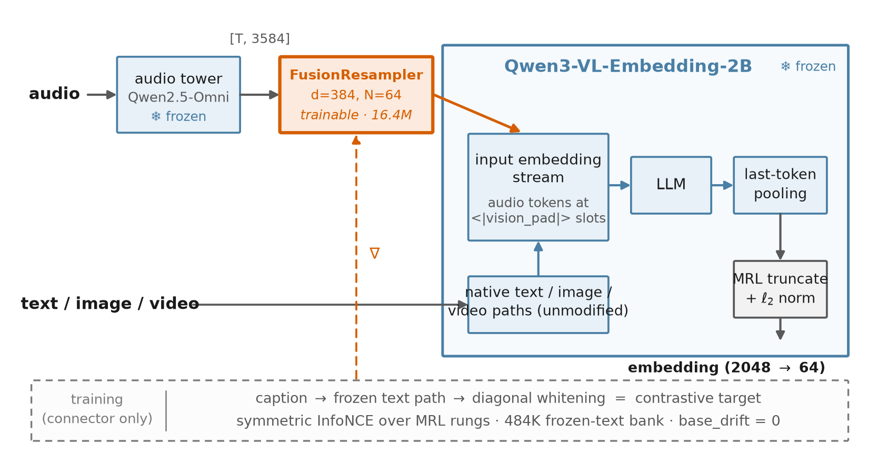
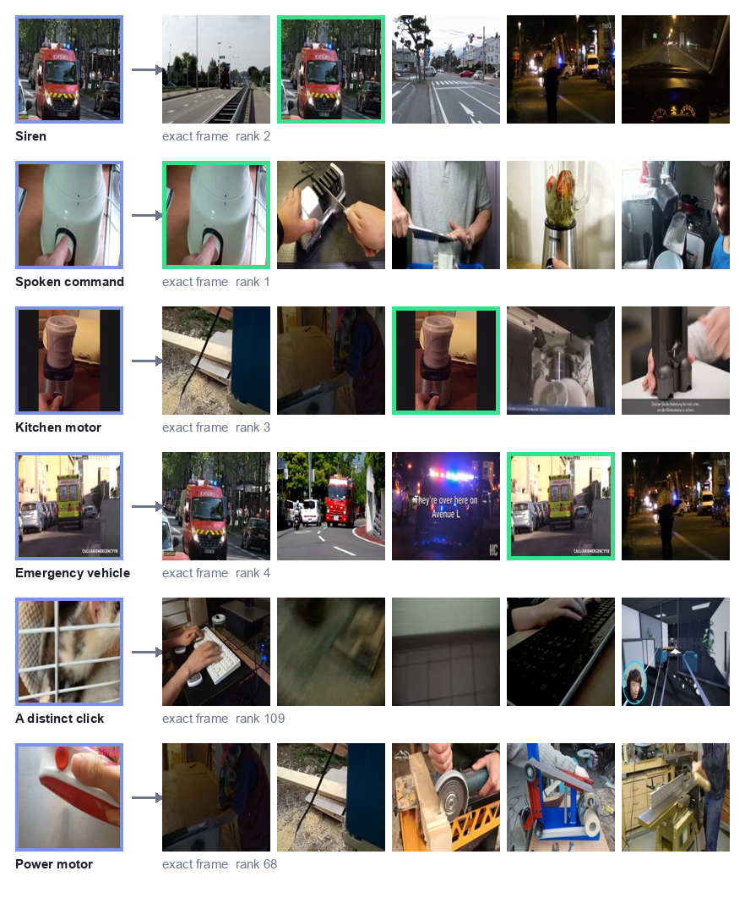

<div align="center">


**One model. One vector space. Text, image, video, audio — and PDF.**

*An open-weight multimodal embedding model that extends a state-of-the-art
vision-language embedding base with audio — without modifying a single base weight.*

[](#)
[](#)
[](LICENSE)
[](#roadmap)

</div>

---

## What is Fusion Embedding?

Fusion Embedding is a family of open-weight embedding models that map **five
modalities into a single shared vector space**, built for retrieval, RAG,
clustering, and cross-modal search — and designed to be **fully self-hostable**.
Two architecture generations are released:
[**fusion-embedding-1**](https://huggingface.co/EximiusLabs/fusion-embedding-1-2b-preview)
(connector-only, final at v0.3) and
[**fusion-embedding-2**](https://huggingface.co/EximiusLabs/fusion-embedding-2-2b-preview)
(connector + modality-gated deep adapters — the current line).

Instead of training a multimodal embedder from scratch, Fusion takes
[Qwen3-VL-Embedding](https://huggingface.co/Qwen/Qwen3-VL-Embedding-2B) — an
open state-of-the-art text/image/video embedding model — **freezes it
byte-for-byte**, and adds an audio pathway to it: a frozen
[Qwen2.5-Omni](https://huggingface.co/Qwen/Qwen2.5-Omni-7B) audio tower feeds a
small trained connector (the **FusionResampler**, ~16M parameters, <1% of the
base) that translates audio into the base's input space. Audio is aligned to
text contrastively; because text, image, and video already share the base's
space, **audio↔image and audio↔video alignment emerge through the text bridge**
(the ImageBind property). Generation 2 adds **modality-gated deep adapters**
(44.2M parameters across the base's 28 layers) that give the frozen LM in-layer
capacity to process audio — active only on audio inputs, exact pass-throughs for
everything else (see [fusion-embedding-2](#fusion-embedding-2-modality-gated-deep-adapters)).

The result: the base model's text, image, and video embeddings are **provably
unchanged** — every training run asserts parameter-level `base_drift == 0`, and
the adapter gate makes non-audio forwards bitwise identical to the unmodified
base — so you inherit the base's retrieval quality exactly, and add audio on top.

## Highlights

- **Five modalities, one space** — text, image, video, audio, and PDF in a
  single vector space, designed for retrieval in any direction between modalities.
- **Frozen-base architecture** — only audio-side components and a temperature are
  trained (a ~16M-parameter connector in generation 1; 60.6M including gated
  adapters in generation 2 — still ~2.3% of the stack). The base is never
  fine-tuned; its MMEB-V2 performance is inherited unchanged, by construction.
- **Matryoshka embeddings** — truncate to any rung of
  `{2048, 1536, 1024, 512, 256, 128, 64}` and re-normalize; embeddings stay
  consistent at every dimension (default 1024).
- **Instruction-aware audio** — the same clip embeds differently for
  different tasks (*sound description* vs *spoken content* vs *speaker/emotion*),
  matching the base's instruction conditioning.
- **Speech as a first-class target** — the audio tower is Whisper-large-v3-derived;
  speech content, language, and paralinguistics are on the roadmap alongside
  sound events and music.
- **Self-hostable** — no API, no rate limits; runs quantized on a single
  consumer GPU for inference, and the connector-only design keeps training
  costs low.
- **Test-first engineering** — the entire pipeline runs end-to-end on tiny
  CPU stand-ins (no GPU, no `transformers`) via dependency injection at the
  model seams; 125+ unit and E2E tests.

## What audio→image retrieval looks like

The connector is trained **only** on audio↔text pairs — it never sees a single
audio–image example. But because text, image, and video already share the frozen
base's space, audio lands there too, and **audio→image retrieval emerges for free**.
On VGGSound-696 (held out, in the training blacklist → zero leakage), the released
previews retrieve the matching image from sound alone at **R@10 up to 0.443 — 32× the
0.014 random-chance rate** (the record is held by fusion-embedding-2's pre-fine-tune
checkpoint; fusion-embedding-1's best is v0.2 at 0.418). Real examples (v0.2 checkpoint):

**Direct hits** — the clip's own frame comes back in the top 5, surrounded by the same kind of scene:

| The sound | What it retrieved (top-5) | Exact frame |
|---|---|---|
| Metallic clanking and banging | the kitchen it came from, first | rank 1 |
| A dog howling | its own dog, then more howling dogs | rank 1 |
| A cat purring | its own cat, then more purring and meowing cats | rank 1 |
| A siren with a dog howling | its own scene among howling dogs | rank 2 |
| *"Switch on the good piece"* (speech) | the blender being switched on | rank 2 |

**Right neighbourhood** — the exact frame ranks lower (often it's a poor still), but the
top results are the correct *sound* category — the shared space placing audio among the right images:

| The sound | What it retrieved (top-5) | Exact frame |
|---|---|---|
| A man speaking Spanish amid birdsong | a man speaking with birds chirping behind | rank 13 |
| A cat's rhythmic purring | purring and meowing cats | rank 15 |
| Bird chirps and tweets | songbirds, owls, a cawing crow | rank 18 |
| A power-tool whirring | drills and small motors | rank 32 |

Scored with the released `fusion-embedding-1-2b-preview` on `mteb/VGGSound_AV_RETRIEVAL`,
per-modality-centered geometry (see the model card for the full cross-modal table, including
an ImageBind comparison).

## Architecture



The **FusionResampler** is a Flamingo-style perceiver resampler running at a
384-d bottleneck: `in_proj 3584→384` → N=64 learnable latent queries through
L=6 pre-norm blocks (self-attention → cross-attention over audio frames → FFN)
→ `out_proj 384→2048`. Its N output tokens overwrite `<|vision_pad|>` placeholder
positions in the frozen LLM's input-embedding stream — the exact mirror of the
base's image-token mechanism. EOS pooling and the MRL ladder are the base's own;
**audio conforms to the base, never the reverse.**

A per-dimension **text whitening** module (diagonal, MRL-safe, fitted once from
the frozen text embeddings) corrects the anisotropy of decoder-LM embedding
spaces before the contrastive loss — a refinement uniquely available to
frozen-text architectures.

## fusion-embedding-2: modality-gated deep adapters

The first generation forces all audio understanding through the input-side
connector: the frozen LM's 28 layers then process audio tokens with machinery
built purely for text and images. Our controlled experiments located the 2B
bottleneck exactly there — swapping the audio tower for a "better" encoder made
retrieval *worse* (the base's ability to read the features, not the features,
was the limit), while capacity added *inside the layers* helped immediately.

**fusion-embedding-2** therefore attaches a small bottleneck adapter
(`LayerNorm → 2048→384 → SiLU → 384→2048`, 44.2M parameters total) to every
decoder layer, **gated to audio encoding only**: for any text, image, or video
input the adapter hook returns the frozen layer's output untouched — the
non-audio forward pass is *bitwise identical* to the unmodified base, so the
frozen-space guarantee is preserved exactly, not approximately. The output
projections are zero-initialised, making a fresh adapter stack the exact
identity: training starts from generation-1 behaviour and can only improve.

At matched training (same corpus, steps, and protocol), the adapters improved
every retrieval direction in a controlled A/B (+3.4 AudioCaps A→T R@10 at probe
scale, reproduced exactly at 518K-pair scale). The released
[`fusion-embedding-2-2b-preview`](https://huggingface.co/EximiusLabs/fusion-embedding-2-2b-preview)
beats fusion-embedding-1 v0.3 on the majority of release-protocol cells, with
its largest gains in text→audio retrieval (AudioCaps T→A R@10 0.746 → 0.775;
Clotho zero-shot T→A R@10 0.460 → 0.482) and on VGGSound audio↔text
(0.625/0.645 → 0.665/0.681 — +4.0/+3.6), extending the lead over every unified
embedding model we measure against.

## Model family

| Model | Base | Params (trained / total) | Embedding dim | MRL ladder | Status |
|---|---|---|---|---|---|
| [`fusion-embedding-2-2b-preview`](https://huggingface.co/EximiusLabs/fusion-embedding-2-2b-preview) | Qwen3-VL-Embedding-2B | 60.6M / 2B | 2048 | 2048 → 64 | **preview released (current line)** |
| [`fusion-embedding-1-2b-preview`](https://huggingface.co/EximiusLabs/fusion-embedding-1-2b-preview) | Qwen3-VL-Embedding-2B | ~16M / 2B | 2048 | 2048 → 64 | **released — final (v0.3)** |
| `fusion-embedding-2-8b` | Qwen3-VL-Embedding-8B | scaled / 8B | ~4096 | ~4096 → 64 | planned |

> **Research previews available:**
> [EximiusLabs/fusion-embedding-2-2b-preview](https://huggingface.co/EximiusLabs/fusion-embedding-2-2b-preview)
> (current line — connector + gated adapters) and
> [EximiusLabs/fusion-embedding-1-2b-preview](https://huggingface.co/EximiusLabs/fusion-embedding-1-2b-preview)
> (generation 1, final at v0.3) — trained weights, model cards with benchmarks
> (AudioCaps / Clotho zero-shot / VGGSound cross-modal incl. an ImageBind
> comparison), and a packaged inference API. Training continues on the
> generation-2 line.

## Usage

For the packaged high-level API, see `inference.py` on the
[HF model repo](https://huggingface.co/EximiusLabs/fusion-embedding-1-2b-preview)
(`FusionEmbedder.embed_audio / embed_text / embed_image`). The low-level path
using this repository's components:

```python
import torch
from fusion_embedding.config import FusionConfig
from fusion_embedding.model import FusionEmbeddingModel
from fusion_embedding.hf_components import load_components

# Load the frozen Qwen base + Omni audio tower + the trained connector.
# NOTE: base precision must match the checkpoint's training precision (recorded in the
# checkpoint as `base_4bit`); released checkpoints are bf16-trained.
cfg = FusionConfig()
cfg, embed_tokens, base_lm, audio_encoder, tokenizer, feature_extractor = load_components(
    cfg, device="cuda", load_in_4bit=False,
)
model = FusionEmbeddingModel(cfg, embed_tokens, base_lm, audio_encoder)
ckpt = torch.load("fusion-embedding-1-2b-preview.pt")
model.resampler.load_state_dict(ckpt["resampler"])
model.text_whitening.load_state_dict(ckpt["text_whitening"])

# --- embed an audio clip -----------------------------------------------------
mel = feature_extractor(wav, sampling_rate=16_000, return_tensors="pt")["input_features"]
audio_tok = model.audio_tokens(mel.cuda())                 # frozen tower -> resampler
pooled = model.encode_audio(audio_ids, audio_mask, audio_tok)
audio_emb = model.embed(pooled, dim=1024)                  # MRL-truncate + L2-normalize

# --- embed a query (the base model's chat-template format is REQUIRED) --------
query = ("<|im_start|>system\nRetrieve audio by sound description.<|im_end|>\n"
         "<|im_start|>user\nA dog barks while rain falls.<|im_end|>\n"
         "<|im_start|>assistant\n")
ids = tokenizer(query, return_tensors="pt", add_special_tokens=False)
pooled_t = model.text_whitening(model.encode_text(ids["input_ids"].cuda(),
                                                  ids["attention_mask"].cuda()))
text_emb = model.embed(pooled_t, dim=1024)

score = (audio_emb @ text_emb.T)                           # cosine similarity
```

For a packaged, higher-level API (`FusionEmbedder.embed_audio / embed_text / embed_image`),
see `release/inference.py` — it applies the correct templates and pooling automatically.

**Matryoshka truncation** — pick your speed/quality point at query time, no
re-encoding:

```python
emb_full  = model.embed(pooled, dim=2048)   # maximum quality
emb_fast  = model.embed(pooled, dim=256)    # 8× smaller index
emb_edge  = model.embed(pooled, dim=64)     # 32× smaller index
```

**Instruction taxonomy** — prefix the *query* side with the task instruction
(the audio side is always neutral):

| Task | Instruction |
|---|---|
| `sound` | Retrieve audio by sound description. |
| `speech_content` | Retrieve audio by spoken content. |
| `music` | Retrieve music by description. |
| `speech_language` | Retrieve speech by language. |
| `speech_paralinguistic` | Retrieve speech by speaker and emotion. |

## Training

Training is deliberately cheap: **both towers are frozen**, so every expensive
forward pass is paid once and cached.

```
audio ──▶ Whisper mel (once) ──▶ frozen audio tower (once) ──▶ frame shards
captions ──▶ frozen text tower (once) ──▶ text-embedding cache ─┐
                                                                ▼
        connector-only training: frames + cached text ─▶ InfoNCE over the MRL
        ladder + CORAL, with a full-corpus frozen-text negative bank
```

Key properties:

- **Frozen-text negative bank** — because the text tower never moves, cached
  text embeddings are exact forever: every training step scores audio against
  the *entire corpus* of captions as negatives, with zero staleness (the classic
  memory-bank failure mode doesn't exist here).
- **Symmetric InfoNCE over the MRL ladder** + learnable temperature + light
  CORAL covariance alignment; debiased-contrastive and hard-negative knobs for
  later stages.
- **Regression guard** — every run snapshots the base's parameters and asserts
  `base_drift == 0.0` at the end. If the base moved, the run fails.
- **Crash-safe by default** — atomic resume checkpoints every 100 steps
  (config-fingerprinted so A/B arms can never cross-resume), automatic retry on
  preemption, and a divergence guard that stops non-finite losses immediately.

The reference training stack runs on [Modal](https://modal.com) (L4 for
preprocessing, A100/H100 for training) with storage decoupled behind a single
`FUSION_DATA_ROOT` env var — a Modal Volume, local disk, or S3 bucket all work.

```bash
uv sync                                                        # install (uv + torch cu124)
uv run pytest tests/ -q                                        # 125+ tests, CPU-only, no GPU needed
uv run python -m fusion_embedding.demo_stage1                  # whole P1 loop on tiny CPU stand-ins

# real pipeline (Modal)
uv run --env-file .env modal run modal_app.py::preprocess           # audio -> mel
uv run --env-file .env modal run modal_app.py::precompute_frames    # frozen tower -> frame shards
uv run --env-file .env modal run modal_app.py::precompute_text_cache
uv run --env-file .env modal run --detach modal_app.py::train_frames_a100  # connector training
```

## Results — preview checkpoints

Numbers for the released previews:
[`fusion-embedding-1-2b-preview`](https://huggingface.co/EximiusLabs/fusion-embedding-1-2b-preview)
v0.1 (131K-pair corpus), v0.2 (484K-pair corpus incl. the full AudioCaps train split
and a 318K LAION-FreeSound subset), v0.3 (v0.2 + a connector-only in-domain fine-tune
on the AudioCaps train split), and
[`fusion-embedding-2-2b-preview`](https://huggingface.co/EximiusLabs/fusion-embedding-2-2b-preview)
(gated adapters, 592K corpus with 73,716 no-sound-content clips excluded, soft-label +
false-negative-mask contrastive flags, same in-domain fine-tune stage). Full tables and
protocol details are on the model cards.

**Audio–text retrieval** (published protocols):

| Benchmark | Model | A→T R@1 | A→T R@10 | T→A R@10 |
|---|---|---|---|---|
| AudioCaps test (883 clips, 5-ref min-rank) | FE1 v0.1 | 0.216 | 0.626 | 0.680 |
| AudioCaps test | FE1 v0.2 | 0.279 | 0.717 | 0.736 |
| AudioCaps test | FE1 v0.3 | **0.332** | 0.741 | 0.746 |
| AudioCaps test | **FE2** | 0.302 | **0.743** | **0.775** |
| Clotho v2.1 eval, zero-shot (1,045 × 5 refs) | FE1 v0.1 | 0.064 | 0.252 | 0.329 |
| Clotho v2.1 eval, zero-shot | FE1 v0.2 | **0.135** | **0.448** | 0.449 |
| Clotho v2.1 eval, zero-shot | FE1 v0.3 | **0.135** | 0.433 | 0.460 |
| Clotho v2.1 eval, zero-shot | **FE2** | 0.127 | 0.421 | **0.482** |

CLAP-family models that fine-tune both encoders end-to-end score higher on AudioCaps
(A→T R@10 0.906–0.928); the fusion-embedding models keep both towers frozen.

**Cross-modal retrieval** (VGGSound-AV, 696 pairs, chance R@10 = 0.014; the
fusion-embedding models train on audio–text only — their audio↔image alignment is
emergent):


| Model | audio↔image | audio↔text | text↔image |
|---|---|---|---|
| ImageBind-Huge | **0.718 / 0.720** | 0.404 / 0.348 | 0.243 / 0.282 |
| LanguageBind | 0.365 / 0.415 | 0.547 / 0.331 | 0.221 / 0.283 |
| Gemini Embedding 2 (API, 2026-07-09) | 0.312 / 0.316 | 0.379 / 0.374 | 0.273 / **0.366** |
| fusion-embedding-1-2b-preview v0.1 | 0.368 / 0.388 | 0.555 / 0.592 | 0.331 / 0.319 |
| fusion-embedding-1-2b-preview v0.2 | 0.418 / 0.440 | 0.588 / 0.631 | 0.331 / 0.319 |
| fusion-embedding-1-2b-preview v0.3 | 0.407 / 0.428 | 0.625 / 0.645 | **0.331** / 0.319 |
| **fusion-embedding-2-2b-preview** | 0.392 / 0.430 | **0.665 / 0.681** | — / — |

Each baseline wins only its supervised pair — except LanguageBind, whose supervised
audio↔text the fusion-embedding models also exceed. LanguageBind's branches fine-tune
diverging copies of the text tower (measured mean caption cosine 0.55 between
branches), weakening its cross-branch binding — a direct illustration of why this
project keeps the shared space frozen. Against Gemini Embedding 2 — Google's natively
multimodal embedding API, evaluated at its documented default invocation on the date
shown — the fusion-embedding models lead audio↔image (both directions, ours emergent)
and audio↔text (both directions), and split text↔image. fusion-embedding-2's
text↔image cells are properties of the frozen base (its text and image paths execute
identically) and will be filled with its own readout run. Full protocol notes and
caveats on the model cards.

Best emergent audio→image is fusion-embedding-2's pre-fine-tune checkpoint at R@10
0.443 (32× chance); among released fine-tuned checkpoints, FE1 v0.2 scores 0.418 and
FE2 0.392 — the in-domain fine-tune trades ~1–2 points of emergent alignment for its
AudioCaps gains. All with zero audio–image training pairs. What that looks like
(v0.2 examples; query clip's frame left; green = the clip's exact frame among the
top 5):



*Example frames from the [VGGSound](https://www.robots.ox.ac.uk/~vgg/data/vggsound/) dataset (CC-BY-4.0), shown for evaluation illustration.*

**Query robustness (UIQ).** On the [UIQ benchmark](https://github.com/JudeJiwoo/Omni-Embed-Audio)
(user-intent query reformulations; Yoo et al., ACL 2026 — queries CC-BY-4.0), evaluated on
the identical 1,045-clip Clotho pool, v0.3 averages R@10 51.8 across the four positive
query types — parity with LAION-CLAP (53.1), below M2D-CLAP (60.5) and OEA-Qwen7B (62.9).
For context: OEA trains a comparable parameter budget (13.7–17.2M LoRA) inside a dedicated
7B audio-text model with no image/video capability; this model spends its 16.4M keeping
the full multimodal space frozen. Reproduce with `modal_app.py::uiq_eval`.

**MAEB (Massive Audio Embedding Benchmark).** Scores on 10 MAEB(beta) tasks
(mteb 2.18.0, v0.2 checkpoint), with ranks against the live leaderboard as of
2026-07-09 (21–65 models per task, including 7–9B omni models; official submission
in progress):

| Task | Score | Rank | | Task | Score | Rank |
|---|---|---|---|---|---|---|
| UrbanSound8K T2A | 0.94 | **#3**/25 | | SpeechCommands ZS | 19.0 | #11/25 |
| Ravdess zero-shot | 32.2 | **#4**/25 | | Clotho T2A | 27.8 | #12/25 |
| FSD2019Kaggle | 77.8¹ | **#6**/65 | | MACS T2A | 13.2 | #14/25 |
| BeijingOpera | 92.8 | **#6**/65 | | GTZAN reranking | 70.7 | #16/65 |
| Vehicle clustering | 3.5 | #17/65 | | GTZAN genre | 63.9 | #29/64 |

The strongest placements are environmental-sound tasks — the category the MAEB paper
identifies as contrastive audio-text models' strength — achieved with 16.4M trained
parameters and no music or speech training. Reproduce with `modal_app.py::maeb_eval`.

¹ Verified by Freesound id (Zenodo post-competition metadata): 608 of FSDKaggle2019's
4,481 test clips (13.6%) appear in the FSD50K dev split, which is in our training
corpus — so this score is disclosed here but withheld from the official leaderboard
submission. The full FSDKaggle2019 test set is contained in FSD50K (dev+eval), which
likely affects other FSD50K-trained models on this task. All other tasks' data is
verifiably disjoint from training.

**Inference-time option.** `modal_app.py::rescore_qbnorm` adds
[QB-Norm](https://arxiv.org/abs/2112.12777) (CVPR 2022) test-time hubness correction with
a training-caption querybank (no test-set access): measured +1.7 AudioCaps / +1.0 Clotho
T→A R@10. Reported separately from headline numbers, since published baselines do not
use it.

Text, image, and video performance is the frozen base model's published MMEB-V2 results,
unchanged by construction.

## Evaluation protocol

We evaluate on the standard published protocols so numbers are directly
comparable to prior audio-text and multimodal embedding work:

- **AudioCaps test** (multi-reference): A→T scored as min-rank over the 5
  ground-truth captions; R@1/5/10 and mAP@10, both directions.
- **Clotho v2 evaluation** (1045 clips × 5 references, from the canonical
  Zenodo release): strictly **zero-shot** — Clotho never appears in training.
- **MAEB** for breadth across sound, music, and multilingual speech.
- **MMEB-V2 regression**: the base's text/image/video scores must be unchanged —
  guaranteed mechanically by the frozen-base design and asserted every run.

Every training run auto-scores the comparable protocol at the end; eval sets
are blacklisted from all training data by clip id.

## Repository layout

```
fusion_embedding/
  config.py          FusionConfig — every locked dimension + hyperparameter
  model.py           FusionResampler, FusionEmbeddingModel, TextWhitening
  losses.py          FusionContrastiveLoss (InfoNCE × MRL + CORAL + debias/hard-neg)
  memory_bank.py     frozen-text negative banks (FIFO + full-corpus)
  data.py            instruction taxonomy, manifests, collators, sharded streaming
  train_stage1.py    P1 loop, retrieval metrics, whitening, resume ckpts, RegressionGuard
  hf_components.py   real frozen-Qwen wiring (base + Omni audio tower adapters)
  _tiny.py           tiny CPU stand-ins implementing the same three-callable contract
  demo_stage1.py     end-to-end P1 demo on the stand-ins
modal_app.py         the full cloud pipeline: ingestion, caching, training, scoring
tests/               unit + E2E suites — the whole pipeline with no GPU/transformers
```

The frozen base is injected as **three duck-typed callables** (`embed_tokens`,
`base_lm`, `audio_encoder`), so the identical model code runs against the real
Qwen towers or the tiny CPU stand-ins — that seam is what makes the pipeline
fully testable without hardware.

## Roadmap

- [x] **P0 — Infrastructure**: frozen-base wiring, eval harness, CPU-testable pipeline
- [x] **P1 — Audio→text alignment**: connector training at scale, published-protocol
      eval wired into every run; shipped as
      [v0.1-preview](https://github.com/Eximius-Labs/fusion-embedding-1/releases/tag/v0.1-preview)
      (131K pairs) and
      [v0.2-preview](https://github.com/Eximius-Labs/fusion-embedding-1/releases/tag/v0.2-preview)
      (484K pairs — AudioCaps A→T R@10 0.626 → 0.717, Clotho zero-shot 0.252 → 0.448), and
      [v0.3-preview](https://github.com/Eximius-Labs/fusion-embedding-1/releases/tag/v0.3-preview)
      (AudioCaps in-domain fine-tune stage — A→T R@1 0.279 → 0.332, R@10 0.717 → 0.741)
- [x] **P2 — Architecture generation 2**: corpus extended to 592K (FreeSound tail +
      BBC Sound Effects) with 73,716 no-sound-content clips excluded; relevance-aware
      training validated in a matched A/B (soft labels + false-negative masking);
      in-domain fine-tune stage shipped in FE1 v0.3; connector capacity re-test at
      scale complete (d=384 confirmed twice); **modality-gated deep adapters**
      validated in controlled A/Bs and shipped as
      [fusion-embedding-2-2b-preview](https://huggingface.co/EximiusLabs/fusion-embedding-2-2b-preview)
      (AudioCaps T→A R@10 0.775, VGGSound audio↔text 0.665/0.681)
- [ ] **P3 — Speech parity + grounding**: adapter-rank scaling, AudioCaps 2.0
      fine-tuning data, heavy multilingual speech, more query tokens, direct
      audio↔video pairs
- [ ] **P4 — Release**: pre-registered five-modality benchmark, model soup,
      2B stable release; then fusion-embedding-2-8b
- [ ] **Track C corpus**: self-generated, CLAP-gated captions on permissively
      licensed audio — the commercially clean training set

## License

Code: **[Apache-2.0](LICENSE)**. Model weights: the current previews are
**CC-BY-NC-4.0** (research); the release tier will ship under a permissive
license pending a license audit of the frozen audio tower and the
training-data track used (research-posture vs commercially-clean corpora are
kept strictly separate).

## Acknowledgments

Fusion Embedding stands on outstanding open work:
[Qwen3-VL-Embedding](https://huggingface.co/Qwen/Qwen3-VL-Embedding-2B) (the
frozen base), [Qwen2.5-Omni](https://huggingface.co/Qwen/Qwen2.5-Omni-7B) (the
audio tower), the frozen-tower composition precedent of jina-embeddings-v5-omni,
the alignment recipe of e5-omni, ImageBind's emergent-alignment result,
Matryoshka Representation Learning, and the audio-caption data ecosystem
(WavCaps, AudioCaps, Clotho, FSD50K, and the AudioSetCaps pipeline).

## Citation

```bibtex
@software{fusion_embedding_2026,
  title  = {Fusion Embedding 1: A Unified Embedding Space for Text,
            Image, Video, and Audio},
  author = {Tonmoy, Abdul Basit},
  year   = {2026},
  url    = {https://github.com/Eximius-Labs/fusion-embedding-1}
}

@software{fusion_embedding_2_2026,
  title  = {Fusion Embedding 2: A Unified Embedding Space for Text,
            Image, Video, and Audio with Modality-Gated Deep Adapters},
  author = {Tonmoy, Abdul Basit},
  year   = {2026},
  url    = {https://github.com/Eximius-Labs/fusion-embedding-1}
}
```
